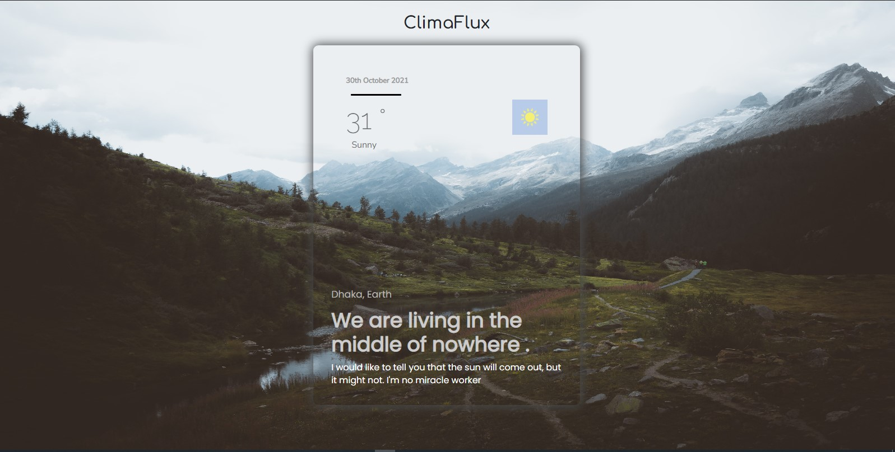

# Weather App 

[](https://lab1b.github.io/ClimaFlux/)

[](https://www.javascript.com)
[](https://reactjs.org/)
[](https://ipgeolocation.io/)
[](https://weatherstack.com/)
[](https://github.com/Naereen/StrapDown.js/blob/master/LICENSE)


## Introduction
A simple weather UI react application. Just takes your IP and send a get request to [IPGeolocationAPi](https://ipgeolocation.io/) and get your city name. After that, It sends another get reqest to a [weather API](https://weatherstack.com/) with the query of your city.



#installation
Use the package manager [NPM](https://www.npmjs.com/) to install the library.

```bash
npm install react bootstrap react-router-dom
```

## Contributing
Pull requests are welcome. For major changes, please open an issue first to discuss what you would like to change.

Please make sure to update tests as appropriate.

## License
[MIT](https://choosealicense.com/licenses/mit/)
